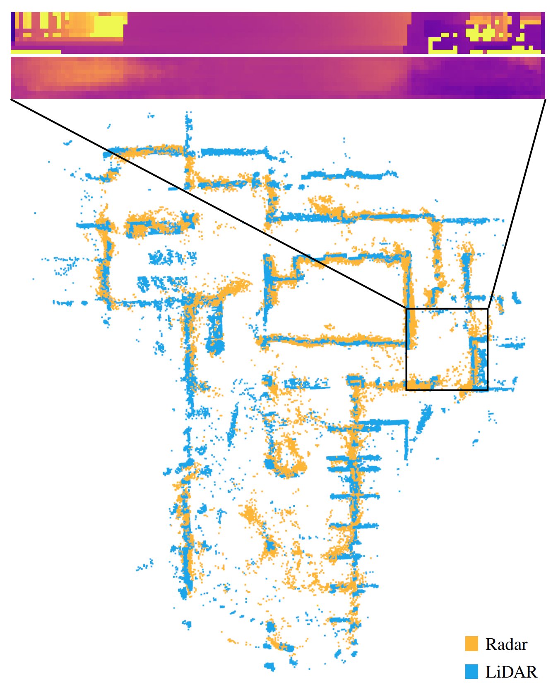

# RadarDepth

**Development history:** Developed locally using Git before publication. These projects were published to GitHub together, so similar upload dates do not indicate when development began.

**Imaging-radar measurements into cylindrical depth maps.**

The pipeline converts ColoRadar measurements, trains a depth-regression network, predicts a visibility mask, and visualizes reconstructed geometry. The existing network, loss functions, calibration assets, and dataset interfaces are preserved.

## Set up

```bash
python -m pip install -r requirements.txt
python radardepth.py --help
```

`train` delegates to `train.py`; `evaluate` delegates to `eval.py`. Use the [complete dataset preparation, training, and evaluation instructions](docs/REFERENCE.md#how-to-use) for required arguments and directory layouts. Real reconstruction needs ColoRadar runs, calibration, and trained model weights. No datasets or checkpoints are bundled by this packaging work.

## Pipeline



This is the retained project illustration. Published research claims and original citation information are preserved in the [reference guide](docs/REFERENCE.md); no new accuracy measurements are implied. The [project license](LICENSE) and bundled ColoRadar-tool documentation remain in place.

## Verification

See [the verification record](docs/VERIFICATION.md) for executed checks and unavailable hardware/model checks. Successful computational behavior is preserved; renamed commands add a presentation layer.

Maintained by [nazeeh111](https://github.com/nazeeh111).
